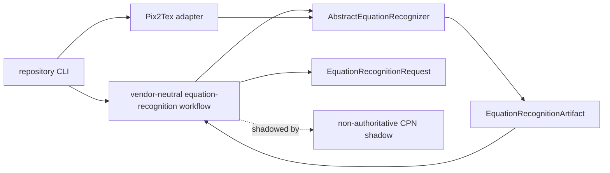

# `scripts.equation_enrichment` schematic

The CLI selects concrete adapters. The workflow depends only on the
vendor-neutral abstraction. The CPN depends on the workflow and never defines
its authority.
