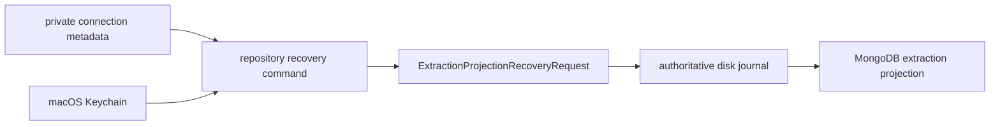

# Extraction projection recovery schematic

```mermaid
flowchart LR
    Metadata["private connection metadata"]
    Keychain["macOS Keychain"]
    CLI["repository recovery command"]
    Request["ExtractionProjectionRecoveryRequest"]
    Journal["authoritative disk journal"]
    Mongo["MongoDB extraction projection"]

    Metadata --> CLI
    Keychain --> CLI
    CLI --> Request
    Request --> Journal
    Journal --> Mongo
```

A dry run reads metadata only. Applied recovery reads exact disk payloads and
never treats MongoDB as publication authority.
