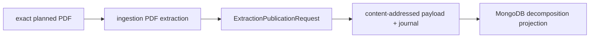

# Extraction publication schematic

```mermaid
flowchart LR
    PDF["exact planned PDF"]
    Extract["ingestion PDF extraction"]
    Request["ExtractionPublicationRequest"]
    Disk["content-addressed payload + journal"]
    Mongo["MongoDB decomposition projection"]

    PDF --> Extract
    Extract --> Request
    Request --> Disk
    Disk --> Mongo
```

MongoDB is downstream of the durable disk commit and remains reconstructable.
